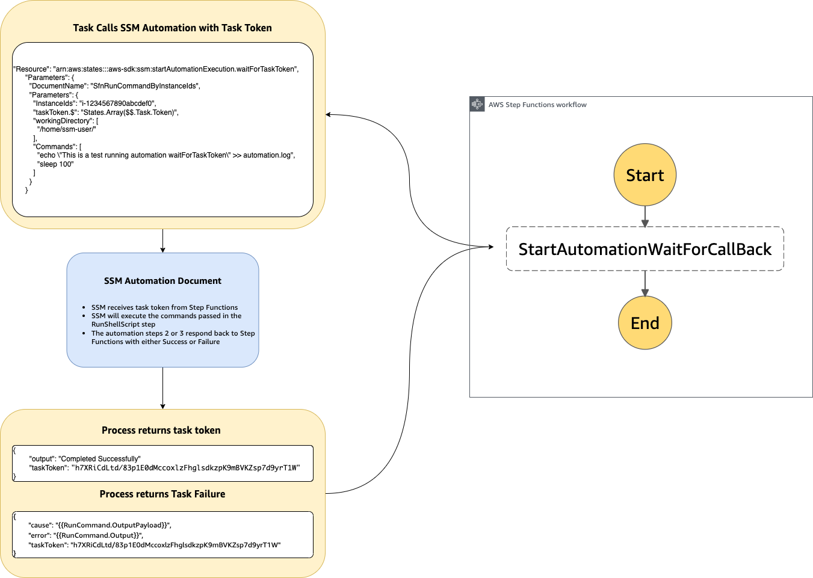

## Step Functions and Systems Manager Automation document .waitForTaskToken implementation

### Summary
In this pattern, we implement an automation document wrapper around AWS-RunShellScript execution for a AWS Step Functions waitForTaskToken integration. This will allow step functions to synchronously call an AWS-RunShellScript.

The following AWS Services are used in this pattern:
- AWS Systems Manager
- AWS Step Functions

#### Automation and scale
The Cloudformation template provided will deploy two Systems Manager Automation documents allowing to run synchronously AWS-RunShellScript task using Targets or Instance Ids from Step Functions:

- **SfnRunCommandByInstanceIds** - SSM documents allowing to execute AWS-RunShellScript by Instance Ids
- **SfnRunCommandByTargets** - SSM documents allowing to execute AWS-RunShellScript by Target
- **SSMSyncRole** - IAM Role assumed by the SSM documents

### Architecture

#### Target technology stack  
- AWS Step Functions
- AWS Systems Manager Automation

#### Target Architecture



### Details
AWS-RunShellScript document automation wrapper will execute the necessary step function api calls send_task_success upon successful execution and send_task_failure when errors occur.

The Cloudformation templates provided will deploy two Systems Manager Automation documents which allows to run automation command using Targets or Instance Ids:
- SfnRunCommandByInstanceIds
- SfnRunCommandByTargets

Each automation document consists of three steps to achieve a synchronous call when using (.waitForTaskToken) option in step functions.

|Step|	Action|	Description|
|----|--------|------------|
|1	|RunCommand|	Executes RunShellScript command|
|2	|SendTaskFailure|	Executed when step 1 is aborted or cancelled and consists of an AWS step function api |call (send_task_failure) having as input the token passed by the step function and the execution failure error and cause
|3	|SendTaskSuccess|	Executed when step 1 is successful and consists of an AWS step function api call |(send_task_success) having as input the token passed by the step function


### Automation documents parameters
#### SfnRunCommandByInstanceIds

|Name|	Type|	Description	|Default Value|
|----|------|---------------|-------------|
|executionTimeout|	Integer|	(Optional) The time in seconds for a command to complete before it is considered to have failed. Default is 3600 (1 hour). Maximum is 172800 (48 hours).	|3600|
|workingDirectory|	String|	(Optional) The path to the working directory on your instance.|	""|
|Commands|	StringList|	(Required) Specify a shell script or a command to run.	|-|
|InstanceIds|	StringList|	(Required) The IDs of the instances where you want to run the command.	|-|
|taskToken|	String|	(Required) Step Function task token for callback response. |-|

#### SfnRunCommandByTargets
|Name|	Type|	Description	|Default Value|
|----|------|---------------|-------------|
|executionTimeout|	Integer|	(Optional) The path to the working directory on your instance.	|3600|
|workingDirectory|	String|	(Optional) The path to the working directory on your instance.	|""|
|Commands|	StringList|	(Required) Specify a shell script or a command to run.	|-|
|Targets|	MapList|	(Required) An array of search criteria that targets instances using Key-Value pairs that you specify. Example: [{"Key":"InstanceIds","Values":["i-02573cafcfEXAMPLE","i-0471e04240EXAMPLE"]}]	|-|
|taskToken|	String|	(Required) Step Function task token for callback response	|-|


#### Sample step function StartAutomationExecution Task parameters 
```json
    "Resource": "arn:aws:states:::aws-sdk:ssm:startAutomationExecution.waitForTaskToken",
    "Parameters": {
            "DocumentName": "SfnRunCommandByInstanceIds",
            "Parameters": {
            "InstanceIds": ["i-1234567890abcdef0"],
            "taskToken.$": "States.Array($$.Task.Token)",
            "workingDirectory": [
                "/home/ssm-user/"
            ],
            "Commands": [
                "echo \"This is a test running automation waitForTaskToken\" >> automation.log",
                "sleep 100"
            ]    
            }
        }
```
### Prerequisites and limitations
#### **Prerequisites and Limitations**
- AWS IAM permission to access all the mentioned AWS services should be in place.
- Ensure that SSM Agent is installed on the instance.
- Ensure AWS IAM instance profile with AWS Systems Manager permission is attached to the instance where the automation document will be executed.

#### **Product versions**
- Automation schema version 0.3
- SSM Agent version 2.3.672.0 or later

Architecture
Target technology stack  
AWS Step Functions
AWS Systems Manager Automation

### Deployment

#### **Create automation documents**

Go to Cloudformation choose create stack and upload the template referenced under [cloudformation/ssm-automation-documents.cfn.json](./cloudformation/ssm-automation-documents.cfn.json)
#### **Create pilot Step Function**

The below sample Step Function definition will call the automation document to execute two commands demonstrating the waitForTaskToken call to Systems Manager automation.

The Task will echo "This is a test running automation waitForTaskToken" into /home/ssm-user/automation.log then sleep for 100 seconds before responding back with the task token to release the next task in the step functions workflow.

Make sure to update the "InstanceIds" with a valid SSM enabled instance on your environment.

For more information on how to create a step function, please check https://docs.aws.amazon.com/step-functions/latest/dg/getting-started.html

```json
{
  "Comment": "A description of my state machine",
  "StartAt": "StartAutomationWaitForCallBack",
  "States": {
    "StartAutomationWaitForCallBack": {
      "Type": "Task",
      "Resource": "arn:aws:states:::aws-sdk:ssm:startAutomationExecution.waitForTaskToken",
      "Parameters": {
        "DocumentName": "SfnRunCommandByInstanceIds",
        "Parameters": {
          "InstanceIds": [
            "i-1234567890abcdef0"
          ],
          "taskToken.$": "States.Array($$.Task.Token)",
          "workingDirectory": [
            "/home/ssm-user/"
          ],
          "Commands": [
            "echo \"This is a test running automation waitForTaskToken\" >> automation.log",
            "sleep 100"
          ]
        }
      },
      "End": true
    }
  }
}
```

#### **Update Step Function IAM Role**

The step function creation will generally create a dedicated role automatically with the function creation however it will not add rights to call SSM automation document. Update the role by adding the following permissions:

```json
{
            "Effect": "Allow",
            "Action": "ssm:StartAutomationExecution",
            "Resource": "*"
}
```
## Security

See [CONTRIBUTING](CONTRIBUTING.md#security-issue-notifications) for more information.

## License

This library is licensed under the MIT-0 License. See the LICENSE file.

## References
[Step Functions getting started](https://docs.aws.amazon.com/step-functions/latest/dg/getting-started.html)

[Step Functions service integration patterns [wait for CallBack]](https://docs.aws.amazon.com/step-functions/latest/dg/connect-to-resource.html#connect-wait-token)

[Step Functions boto3 api call send_task_success and send_task_failure](https://boto3.amazonaws.com/v1/documentation/api/latest/reference/services/stepfunctions.html)

[SSM Automation Documents](https://docs.aws.amazon.com/systems-manager/latest/userguide/systems-manager-automation.html)